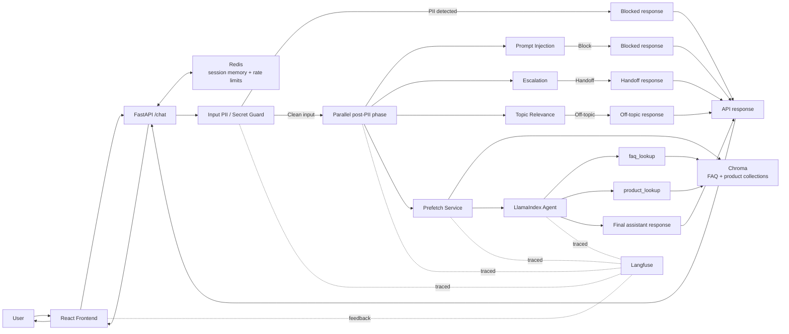
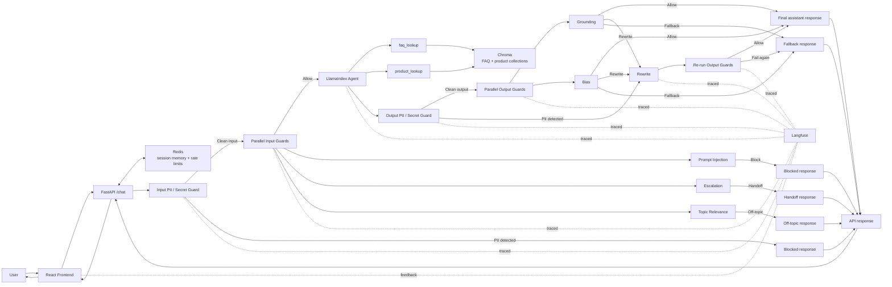

# CustomerServiceAgent

<div align="center">

**An evaluated AI customer support system with RAG, safety guardrails, DeepEval-based iteration, and traceable decision flows**


</div>

`CustomerServiceAgent` is an AI customer support system for the simulated e-commerce company `NexaMarket`, designed to automate common support questions and reduce support workload.

It combines grounded retrieval, explicit guardrails, DeepEval-based evaluation, and production-style backend engineering so the support flow stays inspectable, measurable, and easier to iterate on.

## Project Overview

**NexaSupport** is the demo assistant in this repository. It helps users with product questions, shipping, returns, payments, account topics, and other support workflows through a FastAPI chat backend.

What makes the project interesting is the combination of retrieval-first speed, agent flexibility, safety engineering, and explicit evaluation. The current flow uses a deterministic FAQ and product prefetch step to provide grounded context up front, while a LlamaIndex function agent still keeps `faq_lookup` and `product_lookup` available for cases where the prefetched context is missing, ambiguous, or needs a better reformulated query. Around that, input and output guardrails, DeepEval suites, and Langfuse traces make the full decision path inspectable.

The API is also built with practical backend concerns in mind, including Redis-backed rate limiting, trusted-host enforcement, CORS allowlisting, request IDs, and defensive response headers. There is currently no authentication or authorization layer because the API is intended to be consumed directly by the website without requiring a user login.

## Demo 🎬


## Problem & Motivation 🎯

Large language models are powerful, but they do not reliably know company-specific product catalogs, support policies, or internal FAQ content. In a real support context, that becomes a grounding problem: the model may sound confident while lacking the data it actually needs.

This project addresses that problem with a hybrid retrieval architecture. FAQ data and product data are ingested separately, embedded into a vector store, and queried through a deterministic prefetch step before the agent finishes the turn. The same two domains also remain available as explicit tools, `faq_lookup` and `product_lookup`, so the agent can still refine the search when the prefetched context is not good enough.

That separation is deliberate because FAQ lookups and product discovery are different retrieval tasks. A policy question should not be forced through the product path, and a product search should not be treated like a FAQ answer lookup. Keeping both corpora separate makes ingestion, retrieval, and maintenance more explicit.

Compared with a pure one-shot RAG flow, this design keeps the fast path short for common support questions while preserving the option to use tools when the first retrieval pass is empty, too broad, or based on a weak user query. Compared with a purely tool-driven setup, it also avoids paying the full tool orchestration cost on every request when the deterministic prefetch already contains the answer.

Compared with fine-tuning, this is operationally simpler when FAQs, policies, or product data change frequently because the corpora can be updated and re-ingested without retraining the model. The tradeoff is that more flexibility still requires explicit guardrails, observability, and evaluation to stay reliable.

The broader motivation is reusability, extensibility, and configuration-driven flexibility. The current demo uses simulated AI-generated NexaMarket data, but the architecture is designed so the underlying corpora can be replaced for another company or domain without changing the overall flow. Non-secret runtime behavior is centralized in `src/customer_bot/config/defaults/`, which makes experimentation easier, and provider/runtime wiring is explicit and centralized so additional compatible backends could be added later without changing the overall architecture. Around that, guardrails and tracing make the system more realistic for production-style support scenarios.

## Key Features ✨

### Agentic support workflow

- LlamaIndex `FunctionAgent` with two explicit tools: `faq_lookup` and `product_lookup`
- Tool usage and final agent outputs are observable in traces, including inputs, outputs, and no-match behavior
- Safe fallback responses when the agent or safety pipeline cannot return a reliable answer
- An intentionally measurable architecture that can be simplified if evals show the current agentic path is too slow or too costly

### Dual-source retrieval

- Separate ingestion pipelines for FAQ and product corpora
- CSV schema validation for deterministic ingestion contracts
- Chroma HTTP service with independently configurable collections and retrieval thresholds

### Guardrail pipeline

- Deterministic input PII and secret detection before the parallel input guardrails
- Parallel input guardrails for prompt injection, escalation, and topic relevance
- Agent execution starts after the input PII gate and runs in parallel with the post-PII input guard stage
- Deterministic output PII detection before semantic output checks (`currently off` in the `06.05.2026` benchmark path)
- Parallel output guardrails for grounding and bias, followed by allow, rewrite, or fallback depending on the result (`currently off` in the `06.05.2026` benchmark path)

### Benchmarking and regression safety

- Deterministic DeepEval coverage for input-guardrail behavior via exact string matching
- LLM-as-a-judge DeepEval coverage for answer relevancy, retrieval relevance, and argument correctness
- Deterministic structural coverage for tool correctness
- Separate golden datasets for deterministic guardrails and answered-path agent cases
- Langfuse run versioning so complete eval runs can be filtered and compared directly in dashboards over time

### Observability and feedback

- Langfuse is the optional tracing backend for the chat pipeline and frontend feedback flow
- Traces include agent steps, guardrails, tools, metadata, and user feedback

### Practical backend engineering

- Typed FastAPI request and response contracts
- Redis-backed LLM chat-history memory scoped by `session_id`, shared across API instances, with a rolling 24-hour TTL to keep the API stateless across restarts and scaling
- Configurable Redis-backed rate limiting with a global default limit, a stricter `/chat` budget, trusted-host enforcement, CORS allowlisting, request IDs, and defensive response headers

### Why Redis for Session Memory

<details>
<summary>Show details</summary>

The first version used in-memory session state directly inside the API process. That approach was simple, but it meant chat history was lost on every restart and horizontal scaling would have required sticky routing so each user always reached the same machine. Redis removes that coupling by making short-term session memory shared across API instances, which keeps the API stateless in this area.

I also considered passing the chat history back and forth as part of each API request. That would have worked because session history is already bounded, but it would have inflated every `/chat` payload and pushed transient conversation state into the public API contract. Redis keeps that state server-side instead. The tradeoff is an explicit infrastructure dependency, but the request shape stays smaller and the client does not need to resubmit prior turns on every message.

Redis was chosen over Postgres because this project is a customer-support agent, not a system of record for long-lived conversations. The session history only needs to exist briefly so the agent can answer follow-up questions consistently, and then it should disappear automatically. Persisting the same conversations in the application database would currently add little value, because Langfuse already captures traces and chat-level observability for inspection and analysis. Redis fits this use case well: it is fast, already part of the local infrastructure, and the current memory backend can enforce a rolling TTL of `86400` seconds (24 hours) via `src/customer_bot/config/defaults/memory.yaml`.

The history is also intentionally capped through `memory.max_turns` in `src/customer_bot/config/defaults/memory.yaml`, currently at `20` stored messages, which corresponds to `10` user turns with one assistant reply each. That limit fits the customer-support use case, where chats are usually short and task-focused. It also avoids introducing more complex context-management strategies too early, so the initial design choice here is a fixed bounded history instead.

</details>

## Evaluations 📊

The evaluation setup in this repository is intentionally small and pragmatic. The current goal is not exhaustive dataset coverage, but a clean regression baseline that can be run locally and later in CI/CD.

The overall design is meant for production-style support cases, but at this stage I first want a realistic feel for how the LLM application behaves in terms of performance, costs, scalability, and iteration speed. That is more useful to me right now than starting immediately with `100` golden cases and burning unnecessary implementation time and API costs before the evaluation workflow itself has proven its value.

### Langfuse Integration

Each eval run gets one shared `version` in Langfuse, and the DeepEval scores are written back onto the same traces. That makes it easy to inspect one run locally and compare multiple runs against each other in the dashboard.

### Metric Coverage

| Metric | Why I used it |
| --- | --- |
| `ExactMatchMetric` | Once an input guardrail is triggered, the expected response is deterministic, so I do not need an LLM judge there. |
| `AnswerRelevancyMetric` | I use this as an LLM judge to evaluate whether the final answer is actually relevant to the user request. |
| `ContextualRelevancyMetric` | I use this as an LLM judge to evaluate whether the retrieved context and evidence are relevant to the question. |
| `ToolCorrectnessMetric` | Tool selection is treated as a structural and more deterministic check, so I do not need an LLM judge for that part. |
| `ArgumentCorrectnessMetric` | I use this as an LLM judge to evaluate whether the arguments sent into the tool call are suitable for the retrieval task. |

### Benchmark Comparison

| Metric | 03.05.2026 | 06.05.2026 | Change |
| --- | --- | --- | --- |
| Total Costs | `$0.015889` | `$0.011526` | `-27.459249%` |
| `chat_request` p99 | `7.72s` | `2.07s` | `-73.056995%` |
| `agent_execution` p99 | `4.27s` | `1.42s` | `-66.744731%` |
| Projected Cost / 100k Requests | `$113.49` | `$82.33` | savings `$31.16` from avg request cost derived as `total costs / 14 cases` |

### Current Benchmark Snapshot (06.05.2026)

| Metric | Value |
| --- | --- |
| Total Costs | `$0.011526` |
| Cases | `14` |
| Passed Cases | `14` |

#### Latency Snapshot

| Observation | p50 | p90 | p95 | p99 |
| --- | --- | --- | --- | --- |
| `chat_request` | `1.03s` | `1.99s` | `2.05s` | `2.07s` |
| `agent_execution` | `1.03s` | `1.36s` | `1.40s` | `1.42s` |
| `input_guardrails` | `1.41s` | `1.93s` | `2.00s` | `2.05s` |
| `output_guardrails` | `-` | `-` | `-` | `-` |

`output_guardrails` are kept visible in the summary table for comparability with the older benchmark, but they were not part of the benchmarked request path here.

<details>
<summary>Detailed latency breakdown (06.05.2026)</summary>

| Observation | p50 | p90 | p95 | p99 |
| --- | --- | --- | --- | --- |
| `escalation` | `0.88s` | `1.83s` | `1.86s` | `1.89s` |
| `topic_relevance` | `0.98s` | `1.48s` | `1.77s` | `2.00s` |
| `prompt_injection` | `0.90s` | `1.45s` | `1.54s` | `1.60s` |
| `retrieval_prefetch` | `0.40s` | `0.74s` | `0.82s` | `0.89s` |
| `input_guardrails_pii` | `0.01s` | `0.02s` | `0.07s` | `0.14s` |

</details>

<details>
<summary>Score Snapshot (06.05.2026)</summary>

| Score | What it represents | Count | Avg | 0 | 1 |
| --- | --- | --- | --- | --- | --- |
| `deepeval.guardrail.case_pass (api)` | Overall pass/fail result for the deterministic guardrail cases | `9` | `1` | `0` | `9` |
| `deepeval.guardrail.exact_match (api)` | Whether the returned guardrail answer exactly matches the expected deterministic output | `9` | `1` | `0` | `9` |
| `deepeval.agent.contextual_relevancy (api)` | Whether the retrieved context is relevant to the user request | `4` | `1` | `0` | `4` |
| `deepeval.agent.tool_correctness (api)` | Whether the agent selected the correct retrieval path | `4` | `1` | `0` | `4` |
| `deepeval.agent.case_pass (api)` | Overall pass/fail result for the answered-path agent cases | `4` | `1` | `0` | `4` |

</details>

<details>
<summary>System Architecture as of 06.05.2026</summary>



The current request flow is intentionally explicit. Input PII and secret detection run first and can sanitize or stop the request before later stages see the original sensitive content. Once that gate passes, the post-PII phase fans out in parallel: `prompt_injection`, `escalation`, `topic_relevance`, and the retrieval-first agent path all start from the same clean-input checkpoint.

Inside that agent path, retrieval prefetch runs before the agent answer is produced. It queries both FAQ and product retrieval sources and passes the matches into the agent as advisory context. This keeps common support requests fast when the first retrieval pass is already enough, but it does not remove the agent tools. The agent can still call `faq_lookup` or `product_lookup` with a better reformulated query when the prefetched context is empty, weak, or incomplete.

The final response priority is `prompt_injection` before `escalation` before `topic_relevance` before `agent answer`. That means the agent may already have finished, but its answer is only returned once the input guardrail stage is green.

This benchmark view reflects the newer retrieval-first execution path. Output guardrails still exist in the codebase as optional runtime capabilities, but they are not represented here because this architecture block is meant to describe the benchmarked flow for `06.05.2026`.

</details>

### Observations and Reflections

_To be added in the next iteration._

### Next Iteration Priorities

_To be added in the next iteration._

### Historical Benchmark Snapshot (03.05.2026)

| Metric | Value |
| --- | --- |
| Total Costs | `$0.015889` |
| Cases | `14` |
| Passed Cases | `14` |

#### Latency Snapshot

| Observation | p50 | p90 | p99 |
| --- | --- | --- | --- |
| `chat_request` | `1.51s` | `6.45s` | `7.72s` |
| `agent_execution` | `2.25s` | `4.18s` | `4.27s` |
| `input_guardrails` | `1.02s` | `2.04s` | `2.47s` |
| `output_guardrails` | `1.02s` | `2.10s` | `2.48s` |

<details>
<summary>Detailed latency breakdown (03.05.2026)</summary>

| Observation | p50 | p90 | p99 |
| --- | --- | --- | --- |
| `secret_pii` | `0.01s` | `0.59s` | `0.98s` |
| `topic_relevance` | `1.01s` | `1.86s` | `2.46s` |
| `prompt_injection` | `1.03s` | `2.01s` | `2.04s` |
| `escalation` | `1.00s` | `1.72s` | `1.90s` |
| `grounding` | `1.23s` | `2.19s` | `2.47s` |
| `bias` | `0.78s` | `1.10s` | `1.22s` |
| `output_sensitive_data` | `0.01s` | `0.01s` | `0.01s` |

</details>

<details>
<summary>Score Snapshot (03.05.2026)</summary>

The most obvious score target for the next iteration is `answer_relevancy`, which currently averages `0.92` instead of `1.0`.

| Layer | Score | What it represents | Count | Avg | 0 | 1 |
| --- | --- | --- | --- | --- | --- | --- |
| Guardrails | `case_pass` | Overall pass/fail result for the deterministic guardrail cases | `9` | `1` | `0` | `9` |
| Guardrails | `exact_match` | Whether the returned guardrail answer exactly matches the expected deterministic output | `9` | `1` | `0` | `9` |
| Agent | `contextual_relevancy` | Whether the retrieved context is relevant to the user request | `4` | `1` | `0` | `4` |
| Agent | `tool_correctness` | Whether the agent selected the correct tool path | `4` | `1` | `0` | `4` |
| Agent | `case_pass` | Overall pass/fail result for the answered-path agent cases | `4` | `1` | `0` | `4` |
| Agent | `answer_relevancy` | Whether the final answer is relevant to the user request | `4` | `0.92` | `0` | `3` |
| Agent | `argument_correctness` | Whether the tool-call arguments are suitable for the retrieval task | `4` | `1` | `0` | `4` |

</details>

<details>
<summary>System Architecture as of 03.05.2026</summary>



The request flow in this benchmark was intentionally explicit. Input PII ran first and could block the request immediately before any later guard or trace saw the original detected sensitive content. If that stage passed, the input LLM guards ran in parallel. When multiple input issues were detected, the decision priority was `prompt_injection` before `escalation` before `topic_relevance`. If the input guard stage passed, the LlamaIndex agent was executed with the available retrieval tools.

On the output side, output PII ran before semantic output checks because it could trigger a rewrite without waiting for the grounding or bias checks. After that, `grounding` and `bias` evaluated the answer in parallel. Each output guard could allow the answer, request a rewrite, or force a fallback depending on the situation. If a rewrite was requested, the rewritten answer was passed through the output-guard stage again. Rewrite was useful when an answer was still recoverable, while fallback was used when a response was no longer safe or reliable enough to repair. If a guard fell back, the configured fallback response was returned. How often rewrites could happen depended on `guardrails.global.max_output_retries` in `src/customer_bot/config/defaults/guardrails.yaml`.

This separation was deliberate. Safety-critical checks such as prompt injection, escalation, grounding, and output bias were modeled as explicit guardrails instead of additional agent tools so the main agent was not overloaded with too many competing responsibilities. In practice, this made the system easier to reason about, easier to tune, and easier to observe.

</details>

### Observations and Reflections

On the benchmark dataset from `03.05.2026`, the input guardrails behave as expected, but the latency profile is already a warning sign. The `input_guardrails` stage reaches a `p99` of `2.47s`. In that benchmarked implementation, agent execution only started after the input guardrails had completed and the request was still allowed to continue. That ordering was safe, but not ideal for latency. A better next step was to let the agent run in parallel with the input guard stage while keeping the response priority explicit: `Prompt Injection > Escalation > Off-Topic > Agent result`. If a blocking guardrail triggered, it still needed to win even if the agent had already finished.

The broader issue becomes more visible once I look at the full request path. `chat_request` reaches a `p99` latency of `7.72s`, and `agent_execution` reaches `4.27s`. Those numbers are too high for a practical customer support deployment if they stay like this at scale. The total cost snapshot of `$0.015889` is manageable for a small benchmark, but it is exactly the kind of number that becomes meaningful once the evaluation volume grows and the system moves closer to real usage.

The output side is also revealing. `output_guardrails` reaches a `p99` of `2.48s`, even though the output guardrails did not trigger on this dataset. That suggests they currently add latency and cost without contributing measurable value in this benchmark. That is a good example of an overengineering mistake: the safer design on paper is not automatically the better production tradeoff. Another interesting signal is `secret_pii` at a `p99` of `0.98s`. That looks like a cold-start effect where the relevant resources need to be loaded into memory for the first request. In the next iteration, it is worth testing how useful API warm-ups would be here.

### Next Iteration Priorities

- Run `agent_execution` in parallel with the input guardrails after `secret_pii` passes so the critical path gets shorter.
- Temporarily disable the output guardrails to save cost and reduce latency, because they currently show no measurable value on this benchmark.
- Test whether API warm-ups reduce cold-start effects in the request pipeline.
- Try a deterministic retrieval-first step before agent execution so the agent already gets useful context and tool calls become more optional, and decide whether that should happen before every request or only for selected cases such as the first user message.
- Investigate where caching is actually useful, especially around tool calls, retrieval work, and embedding cost, while choosing it carefully instead of applying it everywhere by default.

## Installation ⚙️

<details>
<summary>Show installation</summary>

### Prerequisites

- Python `>=3.11`
- `uv`
- Docker Desktop or Docker Engine with Compose support
- Recommended: review the versioned defaults in `src/customer_bot/config/defaults/` before running the stack so you understand provider selection, guardrail behavior, API limits, and observability settings
- One model provider:
  - OpenAI with `OPENAI_API_KEY`
  - or local Ollama with pulled models
- Important: with the current defaults, OpenAI-backed configuration is the easiest path and Langfuse startup is fail-fast by default, so missing Langfuse keys or an unreachable Langfuse host can block startup unless you disable fail-fast in `src/customer_bot/config/defaults/observability.yaml`

### Quick Start

1. Clone the repository.

```bash
git clone git@github.com:niels-2005/CustomerServiceAgent.git
cd CustomerServiceAgent
```

2. Install backend dependencies.

```bash
uv sync
```

3. Create the local environment file.

```bash
cp .env.example .env
```

4. Configure your model provider.

- For OpenAI, set `OPENAI_API_KEY` in `.env`.
- For Ollama, ensure Ollama is running locally and review the provider selection in `src/customer_bot/config/defaults/providers.yaml`.

5. Start the required local infrastructure.

```bash
docker compose up -d redis chroma
```

`redis` and `chroma` are named services in `docker-compose.yaml`, so this starts the minimum required infrastructure for `/chat` and retrieval. Make sure `CHAT_MEMORY_REDIS_URL` and `RATE_LIMIT_REDIS_URL` in `.env` point to the reachable local Redis instance. Chroma uses the defaults from `src/customer_bot/config/defaults/retrieval.yaml`, which point to `127.0.0.1:8001` on the host.

6. Install the Presidio language model used by the PII guardrails.

```bash
uv run python -m spacy download de_core_news_md
```

7. Ingest the FAQ and product sources.

```bash
uv run customer-bot-ingest --source faq
uv run customer-bot-ingest --source products
```

8. Start the API.

```bash
uv run customer-bot-api
```

The backend is available at `http://127.0.0.1:8000`.

9. Start the frontend.

```bash
cd frontend
npm install
npm run dev
```

The frontend runs on `http://127.0.0.1:5173`.

### Optional: Full Local Observability Stack

If you also want the full local Langfuse stack with dashboards and traces, start the complete Compose setup:

```bash
docker compose up -d
```

Then:

1. Open `http://localhost:3000`
2. Create an organization and project
3. Generate API keys
4. Add `LANGFUSE_PUBLIC_KEY` and `LANGFUSE_SECRET_KEY` to `.env`

Once configured, the backend returns `trace_id` values on chat responses and the frontend can attach thumbs up/down feedback to the same Langfuse trace.

If you do not want Langfuse to block local startup, set `langfuse.fail_fast: false` in `src/customer_bot/config/defaults/observability.yaml`. Otherwise the API can fail during startup when Langfuse keys are missing or the host is unreachable.

</details>

## API Snapshot 🔌

The public API is intentionally small:

- `GET /health` returns `{"status":"ok"}`
- `POST /chat` accepts:
  - `user_message` as required input
  - `session_id` as optional session continuity input

A `/chat` response can look like this:

```json
{
  "answer": "Ich habe hierzu keine verlaesslichen Informationen gefunden. Kannst du mir die genaue Produktbezeichnung nennen?",
  "session_id": "7e3d5f14-7f43-4a77-a7fb-f7f56ad7ef1c",
  "trace_id": "3b0d9b6e5d9242b2",
  "handoff_required": false,
  "meta": {
    "status": "answered",
    "guardrail_reason": null,
    "retry_used": false,
    "sanitized": false
  }
}
```

Here:

<details>
<summary>Show field explanations</summary>

- `answer` is the final assistant text returned for the turn
- `session_id` identifies the conversation memory bucket and can be reused by the client to continue the same chat
- `trace_id` links the turn to its Langfuse trace when observability is configured
- `handoff_required` allows the frontend to trigger a human-support flow later
- `meta.status` signals the final outcome of the turn and can currently be `answered`, `blocked`, `handoff`, `fallback`, or `session_limit`
- `meta.guardrail_reason` explains why a guardrail changed the outcome when applicable and can currently be `null`, `secret_pii`, `prompt_injection`, `off_topic`, `escalation`, `output_sensitive_data`, `grounding`, `bias`, or `guardrail_error`
- `meta.retry_used` indicates that an output rewrite was attempted
- `meta.sanitized` indicates that sensitive content was removed or masked during processing

</details>

Swagger UI is available at `http://127.0.0.1:8000/docs`.

## Project Structure 🗂️

```text
.
├── src/customer_bot/
│   ├── agent/              # LlamaIndex agent orchestration and tool wiring
│   ├── api/                # FastAPI routes, middleware, errors, and app bootstrap
│   ├── chat/               # top-level chat orchestration across memory, agent, and guardrails
│   ├── config/             # settings models and versioned YAML defaults
│   ├── guardrails/         # input/output guardrails, rewrite flow, and tracing helpers
│   ├── ingest/             # ingestion CLI entrypoints
│   ├── llm_providers/      # OpenAI and Ollama provider integrations
│   ├── memory/             # Redis-backed short-term session memory
│   ├── retrieval/          # corpus ingestion, vector storage, and retrieval services
│   ├── model_factory.py    # provider/model construction and wiring
│   └── observability.py    # Langfuse observability bootstrap
├── frontend/               # simple React/Vite demo frontend
├── datasets/
│   ├── benchmark/
│   │   ├── deepeval_agent_e2e.json   # answered-path DeepEval golden cases for agent + retrieval evaluation
│   │   └── deepeval_guardrails.json  # deterministic DeepEval golden cases for input guardrails
│   └── rag/
│       ├── corpus.csv      # FAQ source data
│       └── products.csv    # product source data
├── tests/
│   ├── evals/              # DeepEval-based end-to-end evaluation suites
│   │   ├── config/         # dedicated eval-only configuration inputs
│   ├── integration/        # broader FastAPI, ingestion, retrieval, and guardrail boundary tests
│   └── unit/               # fast isolated tests for orchestration, contracts, providers, and helpers
├── images/                 # demo and gallery assets
├── docker-compose.yaml     # local infrastructure stack with Redis, Chroma, and the full Langfuse services
└── pyproject.toml          # dependencies, scripts, tooling
```

## Roadmap 🚀

- Add CI/CD with linting, typing, tests, eval execution, container checks, vulnerability scanning, and deployment automation

## Gallery 🖼️

<details>
<summary>🖼️ Show Gallery</summary>

### 1. PII Input Guardrail Triggered


This shows that the request is blocked before it ever reaches the agent. For this version, I intentionally chose a hard block instead of automatic redaction-and-continue behavior.

### 2. Topic Relevance Guardrail


This demonstrates that out-of-scope questions are rejected cleanly. It also shows that the other input guardrails can still run without necessarily triggering a block.

### 3. Prompt Injection Guardrail via Heuristic


This example shows a heuristic short-circuit. The request is blocked for prompt injection without needing to call the guardrail LLM. The heuristic terms are defined in `src/customer_bot/config/defaults/guardrails.yaml` starting at line 39. You can also see that escalation and topic relevance were evaluated too, but prompt injection won because it has the higher configured priority.

### 4. Prompt Injection Guardrail via LLM


This is the LLM-based prompt injection path. It complements the heuristic layer for cases that are less obvious.

### 5. Escalation Guardrail via Heuristic


This example shows a heuristic short-circuit. The request is handed off for escalation without needing to call the guardrail LLM. The heuristic terms are defined in `src/customer_bot/config/defaults/guardrails.yaml` starting at line 137.

### 6. Escalation Guardrail via LLM


This shows a more contextual escalation decision. The current system does not directly connect to a human, but it returns `status="handoff"` and `handoff_required=true` so a frontend could initiate the next step.

### 7. Complete Flow Through the Pipeline


This is the clearest end-to-end trace view: input guardrails, agent execution, tool usage, and output guardrails in one request lifecycle.

### 8. Product No-Match Behavior


This demonstrates that the bot remains reliable when no product match exists instead of hallucinating unsupported details.

### 9. Output PII Guardrail


The output is scanned for sensitive data. If needed, a rewrite is triggered and the revised answer is checked again.

### 10. Grounding Guardrail


This checks whether the final answer is actually supported by retrieval evidence and execution context, with `allow`, `rewrite`, or `fallback` as possible outcomes. In practice, `rewrite` is useful when the answer is mostly grounded but needs tightening, while `fallback` is used when the answer contains unsupported or contradictory claims.

### 11. Bias Guardrail


This checks the assistant answer for potentially harmful or biased phrasing, with `allow`, `rewrite`, or `fallback` as possible outcomes. `Rewrite` is appropriate when the answer is recoverable, while `fallback` is the safer option if the response cannot be repaired reliably.

### 12. Langfuse Default Dashboard


Langfuse already provides a strong default dashboard for costs, latencies, and trace-level visibility out of the box.

### 13. Custom Metrics Dashboard


This custom dashboard tracks higher-level system signals such as guardrail triggers, successful answers, rewrites, and no-match behavior. Langfuse does not currently calculate rates directly in this setup, so derived metrics need to be computed manually. For example, an escalation rate here would be `2 / 17 = 0.11`.

### 14. Trace Filtering for Escalations


Because the API emits structured metadata such as `status`, traces can be filtered for specific operational cases. Escalation is just one example; the same approach can be used for other workflows and error states.

### 15. Session History in Langfuse


Langfuse also makes it easy to inspect conversation history per session and analyze how multi-turn interactions evolve.

### 16. Filtering Negative Feedback


This view shows how user feedback can be used to find problematic interactions quickly and inspect them in context.

</details>

## Verification ✅

Relevant local verification commands for this project:

```bash
uv run ruff check --fix .
uv run ruff format .
uv run ty check src --output-format concise
uv run pytest --collect-only
uv run pytest -m unit
uv run pytest -m "not slow and not network"
uv run pytest -m "integration and not network"
uv run pytest -m "integration and network"
DEEPEVAL_DISABLE_DOTENV=1 uv run deepeval test run tests/evals -m "eval_deterministic"
DEEPEVAL_DISABLE_DOTENV=1 uv run deepeval test run tests/evals -m "eval_llm_judge"
```
