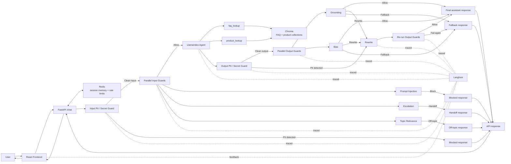

# CustomerServiceAgent

<div align="center">

**An evaluated AI customer support system with RAG, safety guardrails, benchmark-driven iteration, and traceable decision flows**


</div>

`CustomerServiceAgent` is a project that demonstrates a modern AI support assistant for a simulated e-commerce company called `NexaMarket`. It combines FastAPI, LlamaIndex, dual-source retrieval, explicit guardrails, benchmark-driven evaluation, Langfuse tracing, and a simple React frontend into one end-to-end system.

The goal is to show how an LLM application can be structured like a real backend product: grounded retrieval, explicit contracts, safety layers, session handling, observability, benchmark-based regression checks, and a clearly defined HTTP interface. In practical terms, the system is designed to improve customer satisfaction while reducing support workload by handling common support questions quickly and consistently, while also making latency, cost, and quality tradeoffs measurable.

## Project Overview

**NexaSupport for NexaMarket** is the demo assistant inside this repository. Users can ask about products, account topics, shipping, returns, payments, and other support-related workflows through a chat interface backed by a FastAPI backend.

What makes the project interesting is the combination of agentic retrieval, safety engineering, and explicit evaluation. Instead of relying on a single prompt and static context injection, the system uses a LlamaIndex function agent with explicit tools, separate FAQ and product retrieval flows, input and output guardrails, benchmark suites, and Langfuse traces that make the full decision path inspectable.

The API also includes practical HTTP protections such as configurable Redis-backed rate limiting, trusted-host enforcement, CORS allowlisting, request IDs, and defensive response headers. There is currently no authentication or authorization layer because the API is designed to be reachable directly from the website without requiring a user login.

## Demo 🎬


## Problem & Motivation 🎯

Large language models are powerful, but they do not reliably know company-specific product catalogs, support policies, or internal FAQ content. In a real support context, that becomes a grounding problem: the model may sound confident while lacking the data it actually needs.

This project addresses that problem with a retrieval-augmented architecture. FAQ data and product data are ingested separately, embedded into a vector store, and exposed to the agent through two explicit tools: `faq_lookup` and `product_lookup`. These were deliberately separated because they solve different retrieval tasks. A product search should not be forced through the FAQ path, and a support-policy lookup should not be treated like product discovery. Keeping them separate makes ingestion, retrieval, and ongoing maintenance more explicit.

Compared with standard RAG, which typically retrieves vector context once and appends it to an LLM prompt, the agentic setup is more flexible. The agent can decide which tool to call, with which parameters, and those parameters can differ from the raw user input. If an initial tool result is incomplete or not specific enough, the agent can autonomously reformulate the lookup and call a tool again before producing the final answer. It can also decide to stop and return that no reliable information was found instead of forcing an unsupported answer.

The two-tool setup also keeps FAQ and product ingestion/retrieval flows independent. That makes it easier to update either side of the knowledge base without changing the overall agent flow. Compared with fine-tuning, this is operationally simpler when FAQs, policies, or product data change frequently, because the corpora can be updated and re-ingested without re-training the model each time.

That flexibility comes with tradeoffs. The agentic approach introduces more latency than a simpler single-pass RAG flow, and more autonomy does not automatically mean better results. In practice, a more autonomous system usually requires more prompt tuning, tool design, guardrail design, and evaluation to stay reliable.

The broader motivation is reusability, extensibility, and configuration-driven flexibility. The current demo uses simulated AI-generated NexaMarket data, but the architecture is designed so the underlying corpora can be replaced for another company or domain without changing the overall flow. Non-secret runtime behavior is centralized in `src/customer_bot/config/defaults/`, which makes experimentation easier, and provider/runtime wiring is explicit and centralized so additional compatible backends could be added later without changing the overall architecture. Around that, guardrails and tracing make the system more realistic for production-style support scenarios.

## Key Features ✨

### Agentic support workflow

- LlamaIndex `FunctionAgent` with two explicit tools: `faq_lookup` and `product_lookup`
- Tool usage and final agent outputs are observable in traces, including inputs, outputs, and no-match behavior
- Safe fallback responses when the agent or safety pipeline cannot return a reliable answer
- An intentionally measurable architecture that can be simplified if benchmarks show the current agentic path is too slow or too costly

### Dual-source retrieval

- Separate ingestion pipelines for FAQ and product corpora
- CSV schema validation for deterministic ingestion contracts
- Chroma HTTP service with independently configurable collections and retrieval thresholds

### Guardrail pipeline

- Deterministic input PII and secret detection before the parallel input guardrails
- Parallel input guardrails for prompt injection, escalation, and topic relevance
- Agent execution only after the input guard stage passes
- Deterministic output PII detection before semantic output checks
- Parallel output guardrails for grounding and bias, followed by allow, rewrite, or fallback depending on the result

### Benchmarking and regression safety

- Deterministic E2E benchmark coverage for input-guardrail behavior with contract-level assertions on `meta.guardrail_reason`, `meta.status`, `handoff_required`, and linked `trace_id`s
- LLM-as-a-judge benchmark coverage for agent quality, tool selection, and query quality
- Timestamped benchmark reports for latency, cost, contract metrics, guardrail behavior, and agent-quality signals
- Benchmark suites designed as a regression baseline for future CI/CD integration and architecture decisions

### Observability and feedback

- Langfuse is the optional tracing backend for the chat pipeline and frontend feedback flow
- Traces include agent steps, guardrails, tools, metadata, and user feedback

### Practical backend engineering

- Typed FastAPI request and response contracts
- Redis-backed LLM chat-history memory scoped by `session_id`, shared across API instances, with a rolling 24-hour TTL to keep the API stateless across restarts and scaling
- Configurable Redis-backed rate limiting with a global default limit, a stricter `/chat` budget, trusted-host enforcement, CORS allowlisting, request IDs, and defensive response headers

## System Architecture 🏗️



The current request flow is intentionally explicit. Input PII runs first and can block the request immediately before any later guard or trace sees the original detected sensitive content. If that stage passes, the input LLM guards run in parallel. When multiple input issues are detected, the decision priority is `prompt_injection` before `escalation` before `topic_relevance`. If the input guard stage passes, the LlamaIndex agent is executed with the available retrieval tools.

On the output side, output PII runs before semantic output checks because it can trigger a rewrite without waiting for the grounding or bias checks. After that, `grounding` and `bias` evaluate the answer in parallel. Each output guard can allow the answer, request a rewrite, or force a fallback depending on the situation. If a rewrite is requested, the rewritten answer is passed through the output-guard stage again. Rewrite is useful when an answer is still recoverable, while fallback is used when a response is no longer safe or reliable enough to repair. If a guard falls back, the configured fallback response is returned. How often rewrites can happen depends on `guardrails.global.max_output_retries` in `src/customer_bot/config/defaults/guardrails.yaml`.

This separation is deliberate. Safety-critical checks such as prompt injection, escalation, grounding, and output bias were modeled as explicit guardrails instead of additional agent tools so the main agent is not overloaded with too many competing responsibilities. In practice, this makes the system easier to reason about, easier to tune, and easier to observe.

Outside the guardrail and agent decision flow, Redis supports the shared operational state that keeps session memory and API rate limiting consistent across instances. Chroma backs the separate FAQ and product retrieval collections used by `faq_lookup` and `product_lookup`.

### Why Redis for Session Memory

The first version used in-memory session state directly inside the API process. That approach was simple, but it meant chat history was lost on every restart and horizontal scaling would have required sticky routing so each user always reached the same machine. Redis removes that coupling by making short-term session memory shared across API instances, which keeps the API stateless in this area.

I also considered passing the chat history back and forth as part of each API request. That would have worked because session history is already bounded, but it would have inflated every `/chat` payload and pushed transient conversation state into the public API contract. Redis keeps that state server-side instead. The tradeoff is an explicit infrastructure dependency, but the request shape stays smaller and the client does not need to resubmit prior turns on every message.

Redis was chosen over Postgres because this project is a customer-support agent, not a system of record for long-lived conversations. The session history only needs to exist briefly so the agent can answer follow-up questions consistently, and then it should disappear automatically. Persisting the same conversations in the application database would currently add little value, because Langfuse already captures traces and chat-level observability for inspection and analysis. Redis fits this use case well: it is fast, already part of the local infrastructure, and the current memory backend can enforce a rolling TTL of `86400` seconds (24 hours) via `src/customer_bot/config/defaults/memory.yaml`.

The history is also intentionally capped through `memory.max_turns` in `src/customer_bot/config/defaults/memory.yaml`, currently at `20` stored messages, which corresponds to `10` user turns with one assistant reply each. That limit fits the customer-support use case, where chats are usually short and task-focused. It also avoids introducing more complex context-management strategies too early, so the initial design choice here is a fixed bounded history instead.

## Evaluations 📊

The evaluation setup in this repository is intentionally small and pragmatic. The immediate goal was not to maximize dataset breadth, but to establish a first regression baseline for performance, costs, guardrail behavior, and agent quality. In a production setting, these datasets would be expanded with real support cases and executed automatically in a CI/CD pipeline during deployment. The repository was prepared with that later workflow in mind, but the current benchmark scope stays intentionally compact.

### Benchmark 1: Input Guardrails Deterministic

This benchmark focuses on the input guardrail layer with deterministic checks and contract-level assertions. It verifies whether the system produces the expected guardrail outcomes for PII, prompt injection, escalation, and off-topic inputs before the agent is allowed to continue.

This matters because deterministic checks are easier to verify, easier to regression-test, and better suited for focused guardrail validation than subjective scoring. The current dataset is intentionally small, but it can be extended with additional edge cases at any time as the guardrail surface grows.

Dataset: `datasets/benchmark/benchmark_1_input_guardrails_deterministic.json`
Report: `benchmarks/benchmark_1_input_guardrails_deterministic/latest/summary.md`

**Current metrics (01.05.2026)**

#### Performance

| Metric | Value |
| --- | --- |
| Avg Latency | `1.222 s` |
| P50 Latency | `0.945 s` |
| P90 Latency | `3.083 s` |

#### Cost

| Metric | Value |
| --- | --- |
| Avg Price | `0.000266 €` |
| Total Costs | `0.002390 €` |

#### Guardrail Metrics

| Metric | Actual Count | Expected Count | Actual Rate | Expected Rate |
| --- | --- | --- | --- | --- |
| PII | `5` | `5` | `50.00%` | `50.00%` |
| Prompt Injection | `1` | `1` | `10.00%` | `10.00%` |
| Off Topic | `2` | `2` | `20.00%` | `20.00%` |
| Escalation | `1` | `1` | `10.00%` | `10.00%` |

### Benchmark 2: Agent Quality with LLM-as-a-Judge

This benchmark evaluates the end-to-end agent on behavior that is more nuanced than simple contract checks. Because the system is agentic, the evaluation covers both deterministic expectations and LLM-judged quality signals.

The expected tool call is checked deterministically, while the LLM judge evaluates whether the generated tool query is appropriate and whether the final answer is correct and useful. That split is important here: tool selection can usually be verified explicitly, while answer quality and query quality often need judgment over nuance rather than exact string matching.

Dataset: `datasets/benchmark/benchmark_2_agent_quality_llm_judge.json`
Report: `benchmarks/benchmark_2_agent_quality_llm_judge/latest/summary.md`

**Current metrics (01.05.2026)**

#### Performance

| Metric | Value |
| --- | --- |
| Avg Latency | `6.536 s` |
| P50 Latency | `5.898 s` |
| P90 Latency | `8.898 s` |

#### Costs

| Metric | Value |
| --- | --- |
| Avg Price | `0.003064 €` |
| Total Costs | `0.015319 €` |

#### Contract Metrics

| Metric | Actual Count | Expected Count | Actual Rate | Expected Rate |
| --- | --- | --- | --- | --- |
| Answered | `5` | `5` | `100.00%` | `100.00%` |
| Retry Used | `0` | `0` | `0.00%` | `0.00%` |
| Handoff | `0` | `0` | `0.00%` | `0.00%` |
| Unexpected Guardrail | `0` | `0` | `0.00%` | `0.00%` |

#### Agent Quality Metrics

| Metric | Value |
| --- | --- |
| Final Answer Avg Score | `1.0` |
| Final Answer Pass Rate | `100.00%` |
| Trajectory Avg Score | `1.0` |
| Trajectory Pass Rate | `100.00%` |
| Query Quality Avg Score | `0.98` |
| Query Quality Pass Rate | `100.00%` |
| Tool Usage Rate | `100.00%` |
| Tool Error Rate | `0.00%` |
| No Match Rate | `0.00%` |

#### Output Guardrail Signals

| Metric | Actual Rate | Expected Rate |
| --- | --- | --- |
| Fallback | `0.00%` | `0.00%` |
| Grounding | `0.00%` | `0.00%` |
| Bias | `0.00%` | `0.00%` |
| Guardrail Error | `0.00%` | `0.00%` |

### Observations and Reflections

On the current benchmark dataset, the input guardrails behave as expected, but the latency profile is already a warning sign. Benchmark 1 reaches a P90 latency of `3.083 s`, even though this benchmark only exercises the input guardrail path. In the current implementation, agent execution only starts after the input guardrails have completed and the request is still allowed to continue. That ordering is safe, but it is not ideal for latency. A better next step is to let the agent run in parallel with the input guard stage while keeping the response priority explicit: `Prompt Injection > Escalation > Off-Topic > Agent result`. If a blocking guardrail triggers, it should still win even if the agent has already finished.

Benchmark 2 makes the broader issue more visible because it covers the full path of input guards, agent execution, and output guards. A P50 latency of `5.898 s` and a P90 latency of `8.898 s` are too high for a practical customer support deployment. The average cost of `0.003064 €` per run is also not negligible at scale: that would translate to roughly `30.64 €` for `10,000` runs and `306.40 €` for `100,000` runs. On this dataset, the output guardrails did not trigger, which suggests that they currently add latency and cost without contributing measurable value in this benchmark. That is a good example of an overengineering mistake: the safer design on paper is not automatically the better production tradeoff.

The next iteration should therefore focus first on reducing latency and cost before adding more sophistication. Running the agent in parallel with the input guards and temporarily disabling the output guards for focused answer-quality testing should already remove several seconds from the critical path. Manual trace inspection also suggests that explicit tool usage often adds another `3-4` seconds during agent execution. One promising direction is a hybrid approach: run a deterministic first-pass retrieval and provide that context directly to the agent, while still allowing tool calls when the first retrieval is not sufficient. That would combine some of the speed advantages of basic RAG with the flexibility of an agentic system. It may also make sense to apply that strategy only to the first message in a chat rather than every follow-up turn. The open question behind all of this is useful to state directly: agents are powerful, but was a fully agentic setup really the right default for this problem?

## Installation ⚙️

### Prerequisites

- Python `>=3.11`
- `uv`
- Docker Desktop or Docker Engine with Compose support
- Recommended: review the versioned defaults in `src/customer_bot/config/defaults/` before running the stack so you understand provider selection, guardrail behavior, API limits, and observability settings
- One model provider:
  - OpenAI with `OPENAI_API_KEY`
  - or local Ollama with pulled models
- Important: with the current defaults, OpenAI-backed configuration is the easiest path and Langfuse startup is fail-fast by default, so missing Langfuse keys or an unreachable Langfuse host can block startup unless you disable fail-fast in `src/customer_bot/config/defaults/observability.yaml`

### Quick Start

1. Clone the repository.

```bash
git clone git@github.com:niels-2005/CustomerServiceAgent.git
cd CustomerServiceAgent
```

2. Install backend dependencies.

```bash
uv sync
```

3. Create the local environment file.

```bash
cp .env.example .env
```

4. Configure your model provider.

- For OpenAI, set `OPENAI_API_KEY` in `.env`.
- For Ollama, ensure Ollama is running locally and review the provider selection in `src/customer_bot/config/defaults/providers.yaml`.

5. Start the required local infrastructure.

```bash
docker compose up -d redis chroma
```

`redis` and `chroma` are named services in `docker-compose.yaml`, so this starts the minimum required infrastructure for `/chat` and retrieval. Make sure `CHAT_MEMORY_REDIS_URL` and `RATE_LIMIT_REDIS_URL` in `.env` point to the reachable local Redis instance. Chroma uses the defaults from `src/customer_bot/config/defaults/retrieval.yaml`, which point to `127.0.0.1:8001` on the host.

6. Install the Presidio language model used by the PII guardrails.

```bash
uv run python -m spacy download de_core_news_md
```

7. Ingest the FAQ and product sources.

```bash
uv run customer-bot-ingest --source faq
uv run customer-bot-ingest --source products
```

8. Start the API.

```bash
uv run customer-bot-api
```

The backend is available at `http://127.0.0.1:8000`.

9. Start the frontend.

```bash
cd frontend
npm install
npm run dev
```

The frontend runs on `http://127.0.0.1:5173`.

### Optional: Full Local Observability Stack

If you also want the full local Langfuse stack with dashboards and traces, start the complete Compose setup:

```bash
docker compose up -d
```

Then:

1. Open `http://localhost:3000`
2. Create an organization and project
3. Generate API keys
4. Add `LANGFUSE_PUBLIC_KEY` and `LANGFUSE_SECRET_KEY` to `.env`

Once configured, the backend returns `trace_id` values on chat responses and the frontend can attach thumbs up/down feedback to the same Langfuse trace.

If you do not want Langfuse to block local startup, set `langfuse.fail_fast: false` in `src/customer_bot/config/defaults/observability.yaml`. Otherwise the API can fail during startup when Langfuse keys are missing or the host is unreachable.

## API Snapshot 🔌

The public API is intentionally small:

- `GET /health` returns `{"status":"ok"}`
- `POST /chat` accepts:
  - `user_message` as required input
  - `session_id` as optional session continuity input

A `/chat` response can look like this:

```json
{
  "answer": "Ich habe hierzu keine verlaesslichen Informationen gefunden. Kannst du mir die genaue Produktbezeichnung nennen?",
  "session_id": "7e3d5f14-7f43-4a77-a7fb-f7f56ad7ef1c",
  "trace_id": "3b0d9b6e5d9242b2",
  "handoff_required": false,
  "meta": {
    "status": "answered",
    "guardrail_reason": null,
    "retry_used": false,
    "sanitized": false
  }
}
```

Here:

- `answer` is the final assistant text returned for the turn
- `session_id` identifies the conversation memory bucket and can be reused by the client to continue the same chat
- `trace_id` links the turn to its Langfuse trace when observability is configured
- `handoff_required` allows the frontend to trigger a human-support flow later
- `meta.status` signals the final outcome of the turn and can currently be `answered`, `blocked`, `handoff`, `fallback`, or `session_limit`
- `meta.guardrail_reason` explains why a guardrail changed the outcome when applicable and can currently be `null`, `secret_pii`, `prompt_injection`, `off_topic`, `escalation`, `output_sensitive_data`, `grounding`, `bias`, or `guardrail_error`
- `meta.retry_used` indicates that an output rewrite was attempted
- `meta.sanitized` indicates that sensitive content was removed or masked during processing

Swagger UI is available at `http://127.0.0.1:8000/docs`.

## Project Structure 🗂️

```text
.
├── src/customer_bot/
│   ├── agent/              # LlamaIndex agent orchestration and tool wiring
│   ├── api/                # FastAPI routes, middleware, errors, and app bootstrap
│   ├── chat/               # top-level chat orchestration across memory, agent, and guardrails
│   ├── config/             # settings models and versioned YAML defaults
│   ├── guardrails/         # input/output guardrails, rewrite flow, and tracing helpers
│   ├── ingest/             # ingestion CLI entrypoints
│   ├── llm_providers/      # OpenAI and Ollama provider integrations
│   ├── memory/             # Redis-backed short-term session memory
│   ├── retrieval/          # corpus ingestion, vector storage, and retrieval services
│   ├── model_factory.py    # provider/model construction and wiring
│   └── observability.py    # Langfuse observability bootstrap
├── frontend/               # simple React/Vite demo frontend
├── datasets/
│   ├── benchmark/
│   │   ├── benchmark_1_input_guardrails_deterministic.json
│   │   └── benchmark_2_agent_quality_llm_judge.json
│   └── rag/
│       ├── corpus.csv      # FAQ source data
│       └── products.csv    # product source data
├── benchmarks/             # benchmark reports with latest/ and history/ runs
├── tests/
│   ├── e2e/
│   ├── integration/
│   └── unit/
├── images/                 # demo and gallery assets
├── docker-compose.yaml     # local infrastructure stack with Redis, Chroma, and the full Langfuse services
└── pyproject.toml          # dependencies, scripts, tooling
```

## Roadmap 🚀

- Reduce end-to-end latency by restructuring the request flow, especially by exploring parallel agent execution after input PII passes and simplifying the critical path where possible
- Reduce API cost with selective caching and fewer unnecessary model calls, especially in guardrail-heavy and tool-heavy paths
- Evaluate whether a hybrid retrieval approach should replace the current fully agentic default for first-turn queries
- Add CI/CD with linting, typing, tests, benchmark execution, container checks, vulnerability scanning, and deployment automation
- Continue tightening guardrail quality, especially around measurable false positives, clear contracts, and deciding which safeguards are worth their runtime cost

## Gallery 🖼️

<details>
<summary>🖼️ Show Gallery</summary>

### 1. PII Input Guardrail Triggered


This shows that the request is blocked before it ever reaches the agent. For this version, I intentionally chose a hard block instead of automatic redaction-and-continue behavior.

### 2. Topic Relevance Guardrail


This demonstrates that out-of-scope questions are rejected cleanly. It also shows that the other input guardrails can still run without necessarily triggering a block.

### 3. Prompt Injection Guardrail via Heuristic


This example shows a heuristic short-circuit. The request is blocked for prompt injection without needing to call the guardrail LLM. The heuristic terms are defined in `src/customer_bot/config/defaults/guardrails.yaml` starting at line 39. You can also see that escalation and topic relevance were evaluated too, but prompt injection won because it has the higher configured priority.

### 4. Prompt Injection Guardrail via LLM


This is the LLM-based prompt injection path. It complements the heuristic layer for cases that are less obvious.

### 5. Escalation Guardrail via Heuristic


This example shows a heuristic short-circuit. The request is handed off for escalation without needing to call the guardrail LLM. The heuristic terms are defined in `src/customer_bot/config/defaults/guardrails.yaml` starting at line 137.

### 6. Escalation Guardrail via LLM


This shows a more contextual escalation decision. The current system does not directly connect to a human, but it returns `status="handoff"` and `handoff_required=true` so a frontend could initiate the next step.

### 7. Complete Flow Through the Pipeline


This is the clearest end-to-end trace view: input guardrails, agent execution, tool usage, and output guardrails in one request lifecycle.

### 8. Product No-Match Behavior


This demonstrates that the bot remains reliable when no product match exists instead of hallucinating unsupported details.

### 9. Output PII Guardrail


The output is scanned for sensitive data. If needed, a rewrite is triggered and the revised answer is checked again.

### 10. Grounding Guardrail


This checks whether the final answer is actually supported by retrieval evidence and execution context, with `allow`, `rewrite`, or `fallback` as possible outcomes. In practice, `rewrite` is useful when the answer is mostly grounded but needs tightening, while `fallback` is used when the answer contains unsupported or contradictory claims.

### 11. Bias Guardrail


This checks the assistant answer for potentially harmful or biased phrasing, with `allow`, `rewrite`, or `fallback` as possible outcomes. `Rewrite` is appropriate when the answer is recoverable, while `fallback` is the safer option if the response cannot be repaired reliably.

### 12. Langfuse Default Dashboard


Langfuse already provides a strong default dashboard for costs, latencies, and trace-level visibility out of the box.

### 13. Custom Metrics Dashboard


This custom dashboard tracks higher-level system signals such as guardrail triggers, successful answers, rewrites, and no-match behavior. Langfuse does not currently calculate rates directly in this setup, so derived metrics need to be computed manually. For example, an escalation rate here would be `2 / 17 = 0.11`.

### 14. Trace Filtering for Escalations


Because the API emits structured metadata such as `status`, traces can be filtered for specific operational cases. Escalation is just one example; the same approach can be used for other workflows and error states.

### 15. Session History in Langfuse


Langfuse also makes it easy to inspect conversation history per session and analyze how multi-turn interactions evolve.

### 16. Filtering Negative Feedback


This view shows how user feedback can be used to find problematic interactions quickly and inspect them in context.

</details>

## Verification ✅

Relevant local verification commands for this project:

```bash
uv run ruff check --fix .
uv run ruff format .
uv run ty check src --output-format concise
uv run pytest --collect-only
uv run pytest -m unit
uv run pytest -m "not slow and not network"
uv run pytest -m "integration and not network"
uv run pytest -m "integration and network"
uv run pytest -m "eval_deterministic"
uv run pytest -m "eval_llm_judge"
```
