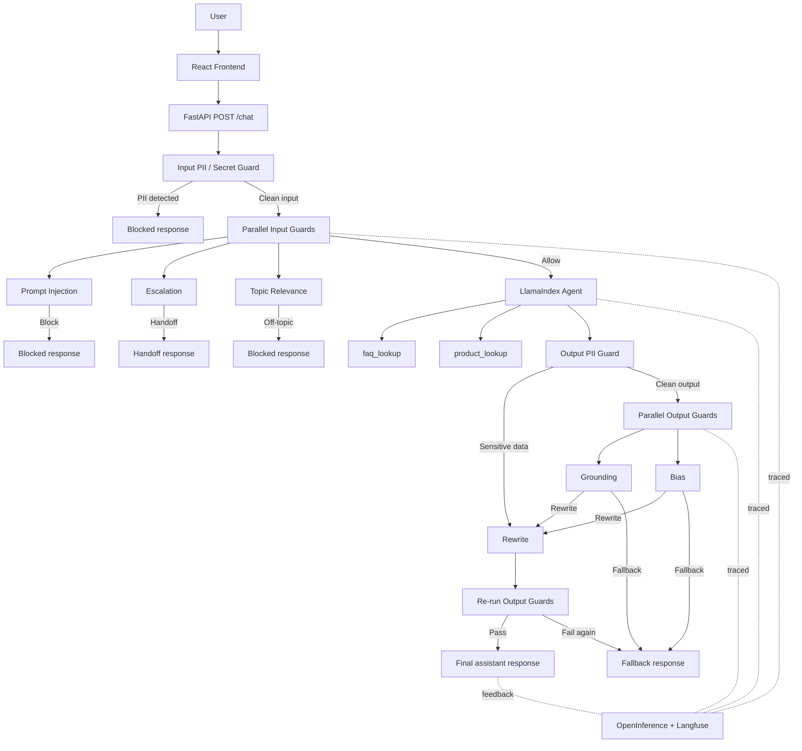

# NexaSupport for NexaMarket

<div align="center">

**An agentic AI customer support system with RAG, safety guardrails, and traceable decision flows**


</div>

`customer-bot` is a portfolio project that simulates a modern AI support assistant for a fictional e-commerce company called `NexaMarket`. It combines FastAPI, LlamaIndex, dual-source retrieval, explicit guardrails, Langfuse tracing, and a React frontend into one end-to-end system.

The goal is not just to "build a chatbot", but to show how an LLM application can be structured like a real backend product: grounded retrieval, explicit contracts, safety layers, session handling, and observability built into the request flow.

## Project Overview

**NexaSupport for NexaMarket** is an AI-powered customer support system for a simulated online retailer in the consumer technology space. Users can ask about products, account topics, shipping, returns, payments, and other support-related workflows through a chat interface backed by a FastAPI API.

What makes the project interesting is the combination of agentic retrieval and safety engineering. Instead of relying on a single prompt and static context injection, the system uses a LlamaIndex function agent with explicit tools, separate FAQ and product retrieval flows, input and output guardrails, and Langfuse traces that make the full decision path inspectable.

## Demo


## Problem & Motivation

Large language models are powerful, but they do not reliably know company-specific product catalogs, support policies, or internal FAQ content. In a real support context, that becomes a grounding problem: the model may sound confident while lacking the data it actually needs.

This project addresses that problem with a retrieval-augmented architecture. FAQ data and product data are ingested separately, embedded into a vector store, and exposed to the agent through two explicit tools: `faq_lookup` and `product_lookup`.

The agentic approach matters because it goes beyond a simple "retrieve once, answer once" RAG pattern. The agent can decide which tool to call, when to call it, and how to react when no reliable match exists. Around that, guardrails and tracing make the system more realistic for production-style support scenarios.

The broader motivation is reusability. The current demo uses NexaMarket data, but the architecture is designed so the underlying corpora can be replaced for another company or domain without changing the overall flow.

## Key Features

### Agentic support workflow

- LlamaIndex `FunctionAgent` with two explicit tools: `faq_lookup` and `product_lookup`
- Tool usage is observable in traces, including inputs, outputs, and no-match behavior
- Safe fallback behavior when the agent cannot produce a reliable grounded answer

### Dual-source retrieval

- Separate ingestion pipelines for FAQ and product corpora
- CSV schema validation for deterministic ingestion contracts
- Local Chroma persistence with independently configurable collections and retrieval thresholds

### Guardrails-first chat pipeline

- Deterministic input PII and secret detection before the agent runs
- Parallel input guardrails for prompt injection, escalation, and topic relevance
- Output guardrails for PII, grounding, and bias with rewrite-or-fallback behavior

### Observability and feedback

- OpenInference instrumentation as the tracing baseline
- Optional Langfuse integration for traces, tool observations, metadata, and user feedback
- Frontend thumbs up/down feedback linked back to the same trace via `trace_id`

### Practical backend engineering

- Typed FastAPI request and response contracts
- Session-based conversation memory scoped by `session_id`
- Explicit API metadata such as `status`, `guardrail_reason`, `handoff_required`, `retry_used`, `sanitized`, and `trace_id`

## System Architecture



The current request flow is intentionally explicit. Input PII runs first and can block the request immediately before any later guard or trace sees the original sensitive content. If that stage passes, the input LLM guards run in parallel. When multiple input issues are detected, the decision priority is `prompt_injection` before `escalation` before `topic_relevance`.

On the output side, output PII runs before semantic output checks because it can trigger a rewrite without waiting for the grounding or bias checks. After that, `grounding` and `bias` run in parallel. If a rewrite is requested, the rewritten answer is checked again. If the output still fails, the pipeline returns a safe fallback instead of retrying indefinitely.

## Tech Stack

- Backend: Python, FastAPI, Pydantic, SlowAPI
- Agent and retrieval: LlamaIndex, Chroma, CSV-based ingestion
- Model providers: OpenAI and Ollama
- Guardrails: Microsoft Presidio plus LLM-based decision guards
- Observability: OpenInference and Langfuse
- Frontend: React, TypeScript, Vite, Radix UI
- Tooling: uv, Ruff, ty, pytest, Docker Compose

## Installation

### Prerequisites

- Python `>=3.11`
- `uv`
- Docker Desktop or Docker Engine with Compose support
- One model provider:
  - OpenAI with `OPENAI_API_KEY`
  - or local Ollama with pulled models

### Quick Start

1. Install backend dependencies.

```bash
uv sync
```

2. Create the local environment file.

```bash
cp .env.example .env
```

3. Configure your model provider.

- For OpenAI, set `OPENAI_API_KEY` in `.env`.
- For Ollama, ensure Ollama is running locally and review the provider selection in `src/customer_bot/config/defaults/providers.yaml`.

4. Install the Presidio language model used by the PII guardrails.

```bash
uv run python -m spacy download de_core_news_md
```

5. Review the versioned YAML defaults in `src/customer_bot/config/defaults/`. The project is designed to keep non-secret runtime defaults there and secrets in `.env`.

6. Ingest the FAQ and product sources.

```bash
uv run customer-bot-ingest --source faq
uv run customer-bot-ingest --source products
```

7. Start the API.

```bash
uv run customer-bot-api
```

The backend is available at `http://127.0.0.1:8000`.

8. Start the frontend.

```bash
cd frontend
npm install
npm run dev
```

The frontend runs on `http://127.0.0.1:5173`.

### Optional: Local Langfuse Setup

If you want end-to-end traces and dashboards, start the local Langfuse stack:

```bash
docker compose up -d
```

Then:

1. Open `http://localhost:3000`
2. Create an organization and project
3. Generate API keys
4. Add `LANGFUSE_PUBLIC_KEY`, `LANGFUSE_SECRET_KEY`, and `LANGFUSE_HOST` to `.env`

Once configured, the backend returns `trace_id` values on chat responses and the frontend can attach thumbs up/down feedback to the same Langfuse trace.

## API Snapshot

The public API is intentionally small:

- `GET /health` returns `{"status":"ok"}`
- `POST /chat` accepts:
  - `user_message` as required input
  - `session_id` as optional session continuity input

Typical `/chat` metadata includes:

- `status`
- `guardrail_reason`
- `handoff_required`
- `retry_used`
- `sanitized`
- `trace_id`

Swagger UI is available at `http://127.0.0.1:8000/docs`.

## Project Structure

- `src/customer_bot/`: backend application code
- `src/customer_bot/config/defaults/`: YAML defaults for API, providers, retrieval, guardrails, observability, and prompts
- `frontend/`: React/Vite chat frontend
- `dataset/`: FAQ and product source data
- `tests/`: unit and integration tests
- `images/`: demo and gallery assets for the project
- `docker-compose.yaml`: optional local Langfuse stack

## Learnings & Reflection

- I already had a solid understanding of agents and RAG before building this project, but guardrails were the most difficult part to get right in practice.
- The main challenge with guardrails was not implementation alone, but reducing false positives without making the system too permissive.
- Deterministic checks and LLM-based checks complement each other well. Deterministic checks are fast and reliable for hard rules, while LLM-based checks are better for contextual judgments such as escalation, topic relevance, grounding, or bias.
- Observability becomes essential very quickly in agent systems. Without traces, it is difficult to understand why a tool was called, why a guardrail fired, or where the pipeline degraded into fallback behavior.
- Memory looks simple in a prototype, but session state becomes an architectural concern as soon as you think about scale, persistence, and stateless deployment.

## Roadmap

- Replace the current in-memory session history with a stateless or persistent memory strategy
- Evaluate migrating local Chroma persistence to Postgres with `pgvector` or a similar production-oriented backend
- Build deterministic evaluation datasets for API and guardrail behavior
- Add non-deterministic evaluation workflows such as human annotation or LLM-as-a-judge
- Add CI/CD with linting, typing, unit tests, integration tests, container builds, vulnerability scanning, and deployment automation
- Continue tightening guardrail quality, especially around rewrite behavior and measurable false-positive rates

## Gallery

### 1. PII Input Guardrail Triggered


This shows that the request is blocked before it ever reaches the agent. For this version, I intentionally chose a hard block instead of automatic redaction-and-continue behavior.

### 2. Topic Relevance Guardrail


This demonstrates that out-of-scope questions are rejected cleanly. It also shows that the other input guardrails can still run without necessarily triggering a block.

### 3. Prompt Injection Guardrail via Heuristic


This example shows a heuristic short-circuit. The request is blocked for prompt injection without needing to call the guardrail LLM.

### 4. Prompt Injection Guardrail via LLM


This is the LLM-based prompt injection path. It complements the heuristic layer for cases that are less obvious.

### 5. Escalation Guardrail via Heuristic


This example shows keyword-driven escalation behavior for higher-risk support situations.

### 6. Escalation Guardrail via LLM


This shows a more contextual escalation decision. The current system does not directly connect to a human, but it returns `status="handoff"` and `handoff_required=true` so a frontend could initiate the next step.

### 7. Complete Flow Through the Pipeline


This is the clearest end-to-end trace view: input guardrails, agent execution, tool usage, and output guardrails in one request lifecycle.

### 8. Product No-Match Behavior


This demonstrates that the bot remains reliable when no product match exists instead of hallucinating unsupported details.

### 9. Output PII Guardrail


The output is scanned for sensitive data. If needed, a rewrite is triggered and the revised answer is checked again.

### 10. Grounding Guardrail


This checks whether the final answer is actually supported by retrieval evidence and execution context, with rewrite or fallback as possible outcomes.

### 11. Bias Guardrail


This checks the assistant answer for potentially harmful or biased phrasing and can request a rewrite if needed.

### 12. Langfuse Default Dashboard


Langfuse already provides a strong default dashboard for costs, latencies, and trace-level visibility out of the box.

### 13. Custom Metrics Dashboard


This custom dashboard tracks higher-level system signals such as guardrail triggers, successful answers, rewrites, and no-match behavior. It is useful for product-level monitoring, not just raw tracing.

### 14. Trace Filtering for Escalations


Because the API emits structured metadata such as `status`, traces can be filtered for specific operational cases like handoff flows.

### 15. Session History in Langfuse


Langfuse also makes it easy to inspect conversation history per session and analyze how multi-turn interactions evolve.

### 16. Filtering Negative Feedback


This view shows how user feedback can be used to find problematic interactions quickly and inspect them in context.

## Technical Notes

The repository name and Python package remain `customer-bot`, while `NexaSupport for NexaMarket` is the product-facing presentation layer for this portfolio version.

Some implementation details worth noting:

- The current memory backend is in-process and bounded by `session_id`
- Chroma persists locally in `.chroma`
- Ingestion is deterministic and keeps FAQ and product collections separate
- Runtime defaults live in `src/customer_bot/config/defaults/`
- Langfuse is explicit and optional; OpenInference instrumentation is the baseline tracing layer

## Verification

Relevant local verification commands for this project:

```bash
uv run ruff check --fix .
uv run ruff format .
uv run ty check src --output-format concise
uv run pytest --collect-only
uv run pytest -m "not slow and not network"
```
